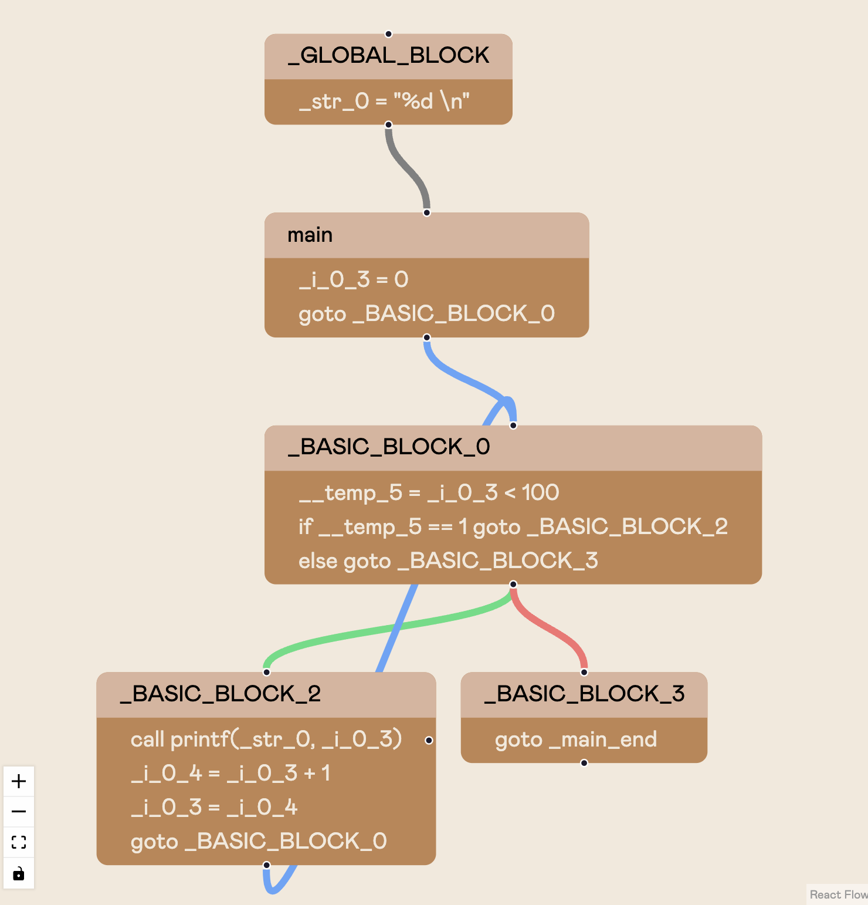

<div align="center">
    <h1>decafe ☕️</ht>
</div>

## Overview 😀

Decafe is a compiler IR visualization tool that I designed for Computer Language Engineering (6.110). The tool allows you to dynamically visualize various compiler optimizations and execute the code within the browser. 

The compiler works on a language called decaf which is a subset of C with some additional features. You can view the entire specification for when I took the class [here](https://6110-sp24.github.io/assets/documents/decaf-specification.pdf). 

<div align="center">
    
</div>

## Setup 💻

First you'll need to set up the following environment variables. First create a `.env.local` file in the root directory with the following values:

```bash
BACKEND_URL=
BACKEND_USERNAME=
BACKEND_PASSWORD=
```

Next create a `.env` in `/server` with the following values:
```bash
USERNAME=
PASSWORD=
PORT=
DEBUG=
DECAF_PATH=
```

Finally, run locally:

```bash
# Install dependencies
yarn install

# Run development server
yarn dev

cd server

# Install dependencies
pip3 install -r requirements.txt

# Run backend server
python3 app.py
```